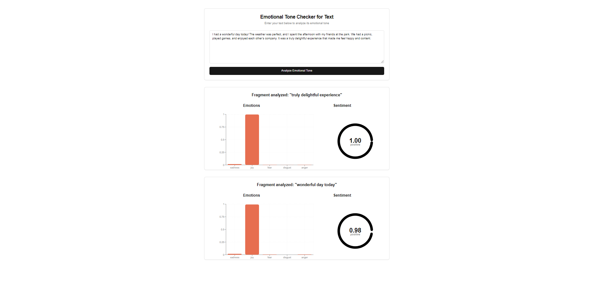

## Emotional Tone Checker for Text

This project is a web application that analyzes the emotional tone of the entered text using IBM Watson Natural Language Understanding.

## Getting Started

1. Clone the repository

```
git clone https://github.com/GrecuAlexandru/texttone.git
```

2. Create an IBM Cloud account
* Go to [IBM Natural Language Understanding](https://www.ibm.com/products/natural-language-understanding) and create an account.
* Unfortunately, you will need to enter a credit card, but IBM offers a free plan and will not charge you.

3. Create a Natural Language Understanding Service
* Go to the IBM Natural Language Understanding](https://www.ibm.com/products/natural-language-understanding) page in the IBM Cloud catalog.
* Sign up for a free IBM Cloud account or log in.
* Click Create.

4. Copy the Credentials
* Go to the Manage page of your service instance.
* Click Show Credentials.
* Copy the API Key and URL.

5. Set Up Environment Variables
* Create a file called .env.local inside the root of the project.
* Add the following lines to the file, replacing the placeholders with your actual API key and URL:

```
IBM_API_KEY="your-api-key"
IBM_SERVICE_URL="your-service-url"
```

6. Install Dependencies and Run the Project
* Install the dependencies by running:

```
npm install
```

* Run the project by running:

```
npm run dev
```

* Open your browser and go to http://localhost:3000 to see the project in action.

## Example Text

You can use the following example text to test the emotional tone analysis:

```
I had a wonderful day today! The weather was perfect, and I spent the afternoon with my friends at the park. We had a picnic, played games, and enjoyed each other's company. It was a truly delightful experience that made me feel happy and content.
```

Here is a screenshot of the project in action:


## Built With

* [Next.js](https://nextjs.org/) - The React framework used
* [IBM Watson Natural Language Understanding](https://www.ibm.com/products/natural-language-understanding) - The API used for emotional tone analysis
* [Shadcn](https://shadcn.com/) - The CSS framework used
